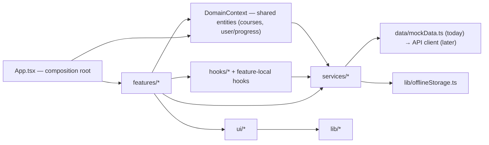

# Architecture Spine — FlexDemy Frontend

## Design Paradigm

**Feature-folder architecture with a repository (service) boundary.**



Four layers, one direction of dependency (bottom of the diagram never imports upward):

- **features/** — composed, stateful. One folder per product surface (Dashboard, CourseDiscover, CourseOverview, CoursePlayer, Assignments, GroupStudy, TutorHub, ProgressAndCertificate). Owns its own feature-local state and subcomponents.
- **ui/** — pure, reusable presentational primitives. No domain knowledge, no data fetching (see AD-3 for the checkable test).
- **hooks/** — cross-feature shared hooks (e.g. `useAccessibilitySettings`, `useOfflineSync`). Feature-local hooks live inside their own feature folder instead.
- **services/** — the data-access boundary. Every read/write of domain data *and* every persistence call (including `localStorage`) goes through here.
- **lib/** — framework- and domain-agnostic utilities (unchanged: `i18n.ts`, `tts.ts`, `offlineStorage.ts`), only ever called from `services/` — **except `lib/editor/` (AD-10), an explicit named exception**: it has no data-access/persistence concern to route through a service, so `features/CourseContentEditor/` calls it directly.

This generalizes the one convention already present in the codebase (`src/components/CoursePlayer/`, a top file + colocated subcomponents) rather than inventing a new pattern.

## Invariants & Rules

### AD-1 — Repository boundary is the only path to data or persistence [ASSUMPTION]

- **Binds:** all data reads/writes and all persistence (mock data today, `localStorage`, and a future API) across the app
- **Prevents:** features or components reaching straight into `data/mockData.ts` or calling `lib/offlineStorage.ts` / raw `localStorage` directly and bypassing a single swappable seam. This is a real, existing bug today: `CourseOverviewScreen.tsx` and `CoursePlayer/ScratchpadPanel.tsx` each independently duplicate `localStorage` read/write logic against the same key.
- **Rule:** only `src/services/*` may import `src/data/mockData.ts` or `src/lib/offlineStorage.ts`. Everything else calls a service function. Service functions are `async` and typed exactly as a future API call would be (e.g. `getCourses(): Promise<Course[]>`), even while they resolve synchronously from mock data today. A hook consuming a service exposes a consistent `{ data, isLoading, error }` shape — no feature invents its own loading/error convention. Swapping mock for a real backend later means editing `services/` only. **Refactor task (not a spine decision):** consolidate the two existing duplicate `localStorage` call sites into `services/userService.ts` / `services/coursesService.ts` as part of this work. **Extended for network calls (a fresh review caught this rule's letter only naming `mockData`/`offlineStorage`, silent on direct `fetch`):** no `features/*`, `ui/*`, `hooks/*`, or Context code may call `fetch`/`axios`/any HTTP client directly — every backend or AI-gateway call goes through a `services/*` function, same as every other persistence call this AD governs.

### AD-2 — App.tsx is a thin composition root [ASSUMPTION]

- **Binds:** `src/App.tsx`, `src/features/**`
- **Prevents:** the God-component pattern already visible today (`App.tsx` holding every feature's state and threading it down through 13 components' worth of props)
- **Rule:** `App.tsx` holds only navigation state (which feature is active) and mounts the Context providers from AD-4. Each feature owns its own *feature-local* state via a colocated hook (`use<FeatureName>.ts`) — every feature folder gets one, even a thin pass-through, so AD-5's hook-testing convention applies uniformly rather than only to features that "seem to need it." Feature-local state and rendering delegate to child components under the same folder; the top component orchestrates.

### AD-3 — Dependency direction is the target contract [ASSUMPTION]

- **Binds:** all `src/` modules
- **Prevents:** circular imports and presentational primitives silently absorbing business logic
- **Rule:** `features/*` may import `ui/*`, `hooks/*`, `services/*`, `lib/*`, `types.ts`, and the Context from AD-4. `ui/*` may import only `lib/*` and `types.ts` (primitive/generic prop shapes only) — never `features/*`, `services/*`, `hooks/*`, or the Domain Context. `services/*` may import only `lib/*` and `types.ts` — never `features/*` or `ui/*`. **Checkable `ui/` test:** a component belongs in `ui/` only if none of its props are feature-specific domain objects it fetches or mutates itself, and it imports nothing from `hooks/` or `services/`. Two components originally assumed to be primitives fail this test and are reclassified: `CourseReviewModal` (fetches/submits review data) moves to `features/CourseOverview/`, and `WeeklyGoalCard` (persists the user's weekly goal) moves to `features/Dashboard/`. **Not yet tool-enforced** — no ESLint/import-boundary linting exists in this repo today (the `lint` script is `tsc --noEmit`, type-checking only); until `eslint-plugin-boundaries` (or equivalent) is added, this rule is enforced by code review. See Deferred. **One sanctioned cross-feature exception (New Course Wizard PRD):** `CourseContentEditor`'s Review-as-Student mode imports `CoursePlayer`'s adaptive-learning components (`DrilldownPanel`, the Adaptive Ways menu, the Exercise runner, the keyword popover) directly, rather than duplicating them — these fail the `ui/` test (they fetch/mutate via `aiGatewayService.ts`), so they can't be promoted to `ui/` either. This is the only `features/*` importing `features/*` this spine permits, and it exists specifically so Review-as-Student renders byte-for-byte identical to what a real student sees (the PRD's own requirement, and AD-6's golden-file tests would otherwise have nothing shared to compare against).

### AD-4 — Shared domain state is Context-backed; only truly single-feature state is feature-local [ASSUMPTION]

- **Binds:** all application state
- **Prevents:** two failure modes — re-centralizing all state in `App.tsx`, and silently under-scoping "cross-cutting" to just auth/language/theme while the actual biggest shared-state surface (course catalog, user progress/points/streak) stays undecided. Today `CoursePlayer` writes `user.progress`/`totalPoints` and `Dashboard`, `CourseOverviewScreen`, and `ProgressAndCertificate` all read them — if each feature independently fetched/cached its own copy per AD's original narrow scope, one feature's mutation (e.g. completing a lesson) would silently not appear in another's view.
- **Rule:** any domain entity read or written by **two or more features** is cross-cutting and lives in a Context provider backed by `services/` (created at the `App.tsx` composition root): a `DomainContext` for `courses` + `user` (profile, progress, points), plus the existing scope for auth/session, active language, and accessibility settings. A domain entity touched by exactly one feature stays local to that feature's hook. No new state-management library is added (React 19 built-in `useState`/`useReducer`/`useContext` only — no redux/zustand/jotai, matching current `package.json`). **`DomainContext.courses` is published-catalog-only** — a fresh review caught this going undecided: the confirmed course-content graph that `CourseContentEditor` and `CoursePlayer`'s Review-as-Student both read/write (New Course Wizard PRD, reshaped by ContentAuthoring PRD — see below) is a *second*, separate cross-cutting entity, not a variant of the catalog entry — it gets its own `CourseContentContext`, backed by `services/courseContentService.ts`, keyed by course ID. Draft/unpublished courses (still in `Draft`/`In Review`/`Review Confirmed`) live **only** in `CourseContentContext`, never in `DomainContext.courses` — `CourseDiscover` and any other published-catalog reader only ever sees `DomainContext.courses`, so an in-progress draft cannot leak into the public catalog by construction, not by convention. **`CourseContentContext`'s shape, reshaped (ContentAuthoring PRD, AD-9's Tiptap decision):** now holds the confirmed **outline metadata** (Chapter/Topic/Subtopic/Page titles + confirmation state, not page bodies) for the currently-open course. A Page's actual body content lives in whichever Tiptap editor instance currently has that Chapter's document open, fetched in one call via the backend's `GET .../chapters/{id}/document` endpoint and synced back per-block via autosave (FR-34) — not held in Context, since nothing needs every Chapter's full document simultaneously and Context re-renders are the wrong tool for editor-internal keystroke-level state.

### AD-5 — Test conventions [ASSUMPTION]

- **Binds:** all new and refactored code
- **Prevents:** untested business logic in services/hooks, and a parallel `__tests__` tree drifting from the source it covers
- **Rule:** `vitest` + `@testing-library/react` + `jsdom`, configured via the `test` key in the existing `vite.config.ts` (no separate test bundler) plus one `vitest.setup.ts` that registers `@testing-library/jest-dom` matchers. Tests live in a top-level `FrontEnd/tests/` tree that mirrors `src/` path-for-path (`tests/features/Dashboard/Dashboard.test.tsx` for `src/features/Dashboard/Dashboard.tsx`, `tests/services/coursesService.test.ts` for `src/services/coursesService.ts`, etc.) — **not** colocated next to source. [UPDATED — supersedes this AD's original colocation choice, per explicit user direction after the initial refactor pass; see memlog.] Because a test's relative depth to its subject no longer matches source-tree colocation, every test imports (and every `vi.mock(...)` target) its subject via the `@/src/*` alias rather than a relative path — e.g. `import { Dashboard } from '@/src/features/Dashboard/Dashboard'`, `vi.mock('@/src/services/coursesService')`. `services/` and hooks get pure-logic unit tests (no DOM); `ui/` primitives get render + interaction tests; each feature's top component gets at least one smoke test asserting it renders and its primary action calls the right service/hook. In feature/`ui/` tests, the service module is the mock boundary — never mock `data/mockData.ts` directly. `package.json` gets a `"test": "vitest"` script.

### AD-6 — Golden-file visual-regression testing via Vitest's browser mode [ASSUMPTION]

- **Binds:** math/chemistry (KaTeX+mhchem) and Hindi/Devanagari rendering parity between editor and student views (extends AD-5)
- **Prevents:** introducing Playwright Test as a second, separately-configured test runner alongside `vitest`, and recurring-cost/opaque-pricing exposure from a hosted visual-regression service (Percy/Chromatic/Applitools)
- **Rule:** Vitest 4's built-in `toMatchScreenshot()` via the `@vitest/browser-playwright` provider — MIT-licensed, no second test runner. **Not** "the same flat `vitest.config.ts` block" as AD-5 (a fresh review caught that claim as wrong: jsdom-environment tests and browser-mode tests can't share one flat `test:` block) — `vitest.config.ts` gains a `test.projects` array with two entries, one keeping AD-5's existing `environment: 'jsdom'` config untouched, one new project scoped to `tests/**/__screenshots__/**` using the `@vitest/browser-playwright` provider; both run from the same `vitest` CLI invocation and the same CI job conceptually, but CI gains one setup step (`npx playwright install --with-deps chromium`) that AD-5's jsdom-only suite never needed. `@vitest/browser-playwright` is version-locked to the exact `vitest` core version (confirmed: mismatched patch versions fail install) — pin both to the same explicit version, never `latest` on one and a range on the other. Golden-file screenshots live alongside their `FrontEnd/tests/` mirror-path tests (e.g. `tests/features/CourseContentEditor/__screenshots__/`), reviewed and updated the same way any other Vitest snapshot is (`vitest -u`). **Determinism for the exact content this AD protects:** KaTeX/mhchem and Devanagari rendering is font-load-dependent — screenshot tests wait for `document.fonts.ready` before capturing, and CI pins the same font files/versions as local dev (no system-font fallback in the CI image) to avoid cross-environment drift on the one content type most exposed to it. Chosen over Playwright Test (a full second toolchain) and hosted services (recurring cost; Applitools' pricing opacity specifically flagged as the kind of surprise this project avoids per its licensing-sensitive stance elsewhere).

### AD-7 — Correlation ID capture lives in one shared HTTP-call helper, not per-service state [ASSUMPTION]

- **Binds:** `services/*` (extends AD-1), the new `errorsService.ts` (`prd-eLearning-ErrorObservability-2026-08-13`, FR-7/FR-23)
- **Prevents:** FR-23's "hold the most recently seen Correlation ID" requirement being implemented separately — and inconsistently — per service file. Confirmed live: `services/*.ts` is inconsistent today — `courseDraftService.ts` already has a shared `write<T>()` helper that reads response bodies centrally, but `courseFileService.ts` and others still duplicate fetch logic per function. Bolting correlation-ID capture onto only the shared helper would mean calls still on the per-function pattern silently never update the retained ID — FR-23 would appear to work in some flows and silently not in others, depending on which service happened to handle a given call.
- **Rule:** a single module-level store (not React state — this value doesn't drive rendering) holds the most recently seen `X-Correlation-Id` response header value. Every `services/*` HTTP call goes through one shared low-level request helper — generalizing `courseDraftService.ts`'s `write<T>()` pattern into `services/httpClient.ts` — that reads the header and updates the store; `courseFileService.ts`'s per-function duplicated fetch logic is retired as part of implementing this feature, not left as a second, silently-noncompliant path. `errorsService.ts`'s FR-7 report call reads the store's current value into its payload when present.

### AD-8 — Site-wide settings are Context-backed via a dedicated SiteSettingsContext [ASSUMPTION]

- **Binds:** the new Admin Settings feature (`prd-eLearning-AdminSettings-2026-08-15`), and any future feature reading a runtime UI setting (font today; color/spacing/logo later, per the PRD's own generic settings table)
- **Prevents:** folding site-wide config into `DomainContext` (AD-4) and blurring its scope the same way `DomainContext.courses` almost did with drafts; and each future setting-consuming feature fetching/caching its own copy, which would let the same setting render inconsistently across the app within one session
- **Rule:** a new `SiteSettingsContext` (`context/SiteSettingsContext.tsx`), separate from `DomainContext`, created at the `App.tsx` composition root (AD-2) — extending AD-4's existing precedent of splitting out a genuinely-different cross-cutting entity (`CourseContentContext`). It fetches active `Setting` rows only (`IsActive=true`) once at app boot via a new `services/settingsService.ts` (AD-1's data-access-boundary rule — one module per domain entity, same async/typed-Promise shape as every other service) — **the boot fetch is scoped to `Setting` rows specifically**, not the backend's separate `FontPairingDefinition` catalog rows (a distinct backend concept, see the backend spine's AD-26); disambiguating this AD's original "fetches all active Settings" phrasing, the two are not the same query. On a successful fetch, it applies the active Font Pairing by calling `document.documentElement.style.setProperty('--font-display', ...)` (and `--font-sans`, `--font-mono`) directly for each CSS custom property — not by injecting/templating a `<style>` tag — the more idiomatic, string-templating-free way to override the custom properties already defined in `index.css`'s `@theme`. **This boot fetch is fail-safe by explicit design, not by accident:** if the fetch fails (network error) or a Setting's Value doesn't resolve to a currently-known-valid value (e.g. a Font Setting whose slug isn't in the picker-list response), `SiteSettingsContext` skips calling `setProperty` entirely and leaves `index.css`'s hardcoded `@theme` defaults in effect — satisfying the PRD's NFR-4 explicitly, not as an unstated side effect of "well, if fetch fails, nothing gets called." **Preview and Apply use two different, structurally-separated mechanisms, not the same call with different callers:** Preview (PRD FR-13, "renders in the Settings screen against sample content, nothing site-wide has changed yet") scopes its candidate font to a wrapper element around only the sample-content preview area (e.g. a `<div style={{ '--font-display': candidateFont, ... }}>` — React inline style setting the same CSS custom properties, but on a local wrapper, not `document.documentElement`), so the candidate can never leak beyond that one preview surface by construction, not by relying on cleanup-on-navigate-away; Apply is the only path that (a) persists via a `settingsService.ts` write call to the backend and (b) updates `SiteSettingsContext`'s stored value, which is the only thing that ever calls `setProperty` on `document.documentElement` (the app-wide target) — Preview never calls the persisting write function and never touches `SiteSettingsContext`'s state. `SiteSettingsContext` also exposes a `useSiteSettings()` hook returning the full fetched settings map (`{ data, isLoading, error }`, matching AD-1's existing service-hook shape convention) in addition to the CSS-custom-property side effect, so this AD's claim to bind future non-CSS-representable settings (e.g. a Logo URL) actually holds — the CSS mechanism alone only covers Font today. The Admin Settings screen itself lives under the existing `features/Admin/` folder as a new `Settings/` subtab — structurally matching the `AiConfiguration/`/`TagManagement/`/`ErrorLog/` sibling precedent already in the seed (same component shape under `features/Admin/`), though its actual authorization tier is Master+Support, matching the backend spine's `FeatureKeys.SettingsManage` (its AD-27) — not `AiConfiguration`/`ErrorLog`'s Master-only gating, which the original draft of this AD cited ambiguously as one undifferentiated precedent. Per AD-2's uniform-hook rule (every feature gets one, even here), the Settings subtab gets its own colocated `useSettings.ts` hook that calls `settingsService.ts` directly for its CRUD/Apply/Restore/history UI — a normal feature hook, not an exception to AD-2. `SiteSettingsContext` remains the separate, read-only, app-wide consumption path — the two never share state.

### AD-9 — Content document editor is built on Tiptap, not hand-rolled `contenteditable` [ASSUMPTION]

- **Binds:** `CourseContentEditor`'s document canvas and page-body editing (ContentAuthoring PRD)
- **Prevents:** two engineers independently reinventing `contenteditable` heading semantics, undo/redo, drag-reorder, or the "/" slash-menu's ARIA combobox wiring — exactly the surface where the UX spine's own reference mock got real accessibility findings wrong (styled `div`s standing in for headings, a missing keyboard-focus-visible "+" affordance) before those were caught and fixed
- **Rule:** `@tiptap/react` + `@tiptap/core` + `@tiptap/starter-kit` (3.x, 3.30.1 confirmed current, MIT license — web-verified Aug 2026) is the editor foundation for `CourseContentEditor`'s document canvas. **Compatibility claim corrected (2026-08-17 review):** compatible with React 19 for the core/react/starter-kit surface actually used here — Tiptap's own issue tracker shows unresolved React 19 gaps elsewhere in its ecosystem (UI Components, Pro extensions, neither used by this AD), so this is scoped confidence, not a blanket "confirmed" across the whole library. `@tiptap/markdown` (official first-party extension, MIT, bidirectional CommonMark-compliant, confirmed stable via npm dist-tags — not the Beta-labeled paid Conversion extension) is the Markdown round-trip layer that makes DD-3's "persists a single Markdown string" contract possible without a hand-rolled serializer — chosen over the community `tiptap-markdown` package (its maintainer has deprecated further work on it in favor of Tiptap's own solution) and over Tiptap's paid Pro Conversion extension, matching this project's established license-sensitivity (AD-3 of the backend spine rejects MediatR on the same grounds; this spine's AD-6/AD-7 make analogous calls). Real native heading elements (`h1`/`h2`/`h3`/`h4` — `EXPERIENCE.md`'s `content-doc-heading`/`content-page-marker`) are Tiptap nodes with `contenteditable` on the node itself, never a styled `div` wrapping a separate input. The "/" slash-command menu is built on Tiptap's `@tiptap/suggestion` utility and documented Slash-Dropdown-Menu UI pattern — **note the underlying `Suggestion` utility is stable, but Tiptap's own official slash-commands example implementation is itself labeled "experimental,"** so treat their example as a starting point to harden, not a drop-in. **This AD binds implementation to `EXPERIENCE.md`'s Accessibility Floor bullets verbatim, not to "ARIA wiring" as a general label:** `role="combobox"`/`aria-expanded`/`aria-controls` on the trigger, `role="listbox"`/`role="option"` on the menu with category labels as skipped `role="group"`, `aria-activedescendant` for the highlighted option, a literal "No matching blocks" zero-match row, Tab never repurposed as in-menu navigation (Arrow keys only, Tab always exits), Escape returning focus to the exact typed position with the "/"+query text stripped, and the keydown handler gated on `!event.isComposing` and scoped to the editor's own region (IME/Firefox-Quick-Find safety) — Tiptap's `Suggestion` utility is a trigger-detection plugin, not a UI/ARIA layer, so every one of these is this feature's own implementation work, not inherited from the library.

### AD-10 — The slash-menu mechanism is generic; the command list is feature-owned [ASSUMPTION]

- **Binds:** the "/" slash-command menu's placement in the folder structure (extends AD-3's checkable `ui/` test, AD-9)
- **Prevents:** either over-genericizing (baking ContentAuthoring-specific block names into a shared primitive) or under-genericizing (rebuilding the menu mechanism from scratch for a future non-course use of the same pattern) — a real requirement surfaced during UX Discovery: the tutor explicitly wants this editing pattern reusable for designing content generally, not hardcoded to this one feature
- **Rule:** the generic Tiptap Suggestion-based menu mechanism (query filter, keyboard nav, positioning, ARIA wiring) has no domain knowledge and lives in a new `lib/editor/` folder — framework-scoped but not feature-scoped, called directly by `features/CourseContentEditor/` (**explicit, named exception to the Design Paradigm's general "`lib/` is only ever called from `services/`" rule** — `lib/editor/` has no data-access or persistence concern to route through a service, unlike every other `lib/` module, so AD-1's boundary discipline doesn't apply to it the same way; this exception is scoped to `lib/editor/` specifically, not a precedent for other `lib/` modules bypassing `services/`). The ContentAuthoring-specific command **list** (Topic heading, New Page, Learning Resources block, Paragraph, Image, Math, …) is feature-owned configuration, assembled in `features/CourseContentEditor/` and passed into the generic menu component as data — the mechanism is reusable, the vocabulary is not, and the two are never conflated into one non-reusable component.
- **Custom Tiptap Node extensions live in `features/CourseContentEditor/extensions/`, not `lib/editor/` (2026-08-17 review — this placement was previously unassigned):** Page marker, Learning Resources block, Callout, Math, and Resource card are custom Tiptap Node/NodeView extensions `@tiptap/starter-kit` doesn't ship — unlike the slash-menu mechanism, these carry real domain knowledge (Page/Resource concepts, ContentAuthoring-specific rendering), so `lib/editor/`'s "no domain knowledge" test excludes them. They're feature-owned, imported into the Tiptap editor instance's extension list assembled in `features/CourseContentEditor/`.
- **Description-zone content restriction is a client-side schema constraint, not server-side-only validation:** FR-4 limits a node's Description to "paragraphs and bullets only," authored inline in the same continuous document as full-palette Page bodies (FR-10). The paragraph/bullet-list nodes immediately following a structural heading, up to the next Page marker or heading, use a distinct Tiptap node-schema context restricted to those two block types — enforced by Tiptap's own schema (an inserted Image/Table/Math node in that zone is rejected by the schema itself, not silently accepted and stripped server-side on save). The slash-menu (AD-10's mechanism) is cursor-position-aware: it queries the active schema context to filter which commands it offers, so a tutor never sees Image/Table/Math as options while inside a Description zone. This position-aware filtering capability lives in `lib/editor/` (it's schema-introspection, not ContentAuthoring vocabulary); which node types belong to which zone is feature-owned configuration, same split as the command list.

### AD-11 — One document, many entities: autosave boundary-detection is a named, owned layer [ASSUMPTION]

*Added 2026-08-17 review — this pass's own reviewer gate flagged this as the single hardest integration surface AD-9 introduces, previously unassigned to any AD.*

- **Binds:** `CourseContentEditor`'s autosave path (FR-34), bridging the single continuous Tiptap document (AD-9) to the backend's per-entity write endpoints (`PATCH /nodes/{id}`, `PATCH /pages/{id}`, `POST /topics`, `POST /pages`, …)
- **Prevents:** two engineers independently inventing incompatible document-to-entity mapping strategies for the exact boundary-detection problem AD-9's own document model creates — the same class of divergence AD-9's "Prevents" clause names one level shallower than this actually reaches
- **Rule:** a dedicated module in `features/CourseContentEditor/` (e.g. `useContentAutosave.ts`) owns document-to-entity decomposition. On each debounced save tick (FR-34): (a) walk the ProseMirror doc from the edited position outward to find the nearest preceding structural heading or Page marker (AD-9's `h1`/`h2`/`h3`/`h4` nodes) and the next heading of equal-or-higher level, establishing that entity's span; (b) extract only that entity's own text/Markdown slice via `@tiptap/markdown`'s serializer, not the whole document; (c) dispatch it to exactly one endpoint — a heading's title/Description edit to `PATCH /nodes/{id}`, a Page body edit to `PATCH /pages/{id}` — via `courseContentService.ts` (AD-1). **A newly-inserted structural heading or Page (via the slash-menu, AD-10) is not client-side-only pending state:** its create call (`POST /topics`, `POST /pages`, etc.) fires synchronously the moment it's inserted, before any content nested under it is considered attachable — a Page marker inserted but not yet id-confirmed blocks further insertion beneath it (a brief, visible "creating…" state) rather than silently accumulating orphaned client-side content with no id to save against.
- **Confirmation-state resync, closing the gap AD-4's Context/editor split otherwise leaves open:** an autosave `PATCH` response includes the affected entity's post-write confirmation state (per FR-44's structural-edit reset rule) in its payload. `useContentAutosave.ts` patches `CourseContentContext`'s corresponding node directly with that field — never a full outline refetch — so the Table-of-Contents rail's Confirmed/Unconfirmed badge and its `aria-live` reversion announcement (EXPERIENCE.md's Accessibility Floor) fire off the same write that caused the reset, not a stale cached copy.

### AD-12 — `lib/markdown.ts` is the single canonical Markdown grammar; Tiptap's serializer is tested against it, not assumed to agree [ASSUMPTION]

*Added 2026-08-17 review — three independent Markdown surfaces (Tiptap's `@tiptap/markdown` serializer, the existing hand-rolled `lib/markdown.ts` renderer, and the backend's unvalidated `BodyMarkdown` passthrough) had no assigned single owner for FR-28's three custom block syntaxes (Math, Callout, Resource card), and AD-6's golden-file tests check rendered pixels, not Markdown-syntax agreement between the two parsers.*

- **Binds:** the three custom Tiptap Node extensions with non-CommonMark syntax (Math `$$…$$`, Callout `> [!note]`, Resource card `[label](resource:{id})` — FR-28) and `lib/markdown.ts`'s corresponding parse/render logic for the same three constructs
- **Prevents:** Tiptap's serializer and `lib/markdown.ts`'s independently-hand-written parser drifting on the exact same syntax — content that round-trips perfectly inside the editor (self-consistent against its own schema) but mis-tokenizes or renders broken in Course Player / Preview, which is the one renderer students and "Preview as student" actually use, defeating FR-46/UJ-1's "she sees the page exactly as a student will"
- **Rule:** `lib/markdown.ts` remains the single canonical grammar authority for what Markdown syntax this product considers valid — it does not change to accommodate Tiptap, Tiptap's custom node serializers are written and tested to emit only what `lib/markdown.ts` already parses. A syntax-level contract test (not AD-6's visual/pixel parity) round-trips each of the three custom block types — Tiptap-serialize → `lib/markdown.ts`-parse → assert structural equality — covering adjacency cases explicitly (e.g. inline math directly beside a Callout in the same paragraph, the exact scenario a hand-written parser is likeliest to mis-tokenize at the boundary). The backend's `Page.BodyMarkdown` column stays an unvalidated `text` passthrough (DD-3's existing posture) — this AD's contract test is what keeps that trust well-founded, not a backend-side validation layer.

## Consistency Conventions

| Concern | Convention |
| --- | --- |
| Component files | `PascalCase.tsx`, one component per file (ratified — matches existing `Dashboard.tsx`, `Navbar.tsx`, etc.) |
| Feature folders | `PascalCase/` under `src/features/` (ratified — matches existing `CoursePlayer/`) |
| Hooks | `camelCase.ts` starting with `use` (e.g. `useCourses.ts`); feature-local hooks live inside their feature folder |
| Services | `camelCase.ts` ending in `Service` (e.g. `coursesService.ts`), one module per domain entity |
| Utility/lib files | `camelCase.ts` (ratified — matches existing `offlineStorage.ts`, `i18n.ts`, `tts.ts`) |
| Mock/constant data | `SCREAMING_SNAKE_CASE` exports (ratified — matches existing `MOCK_COURSES`, `INITIAL_USER`) |
| Shared domain types | `src/types.ts`. A type used by 2+ features stays here; a type used by exactly one feature may move into that feature folder; an already-shared type is never fragmented back out. |
| Imports | Absolute via `@/src/*` (**new convention** — the existing `@/*` alias in `tsconfig.json`/`vite.config.ts` resolves to the project root, i.e. `FrontEnd/`, not `src/`, and has zero current usages; `@/src/features/...` etc. is correct against that existing alias) — no relative `../../../` chains across layers |
| Styling | Tailwind utility classes inline (unchanged, no CSS modules / styled-components introduced) |
| Tests | `FrontEnd/tests/` mirrors `src/` path-for-path (not colocated), imports via `@/src/*`, `vitest` + `@testing-library/react`, service-level mocking |
| Tiptap extensions | `PascalCase.ts` under `features/CourseContentEditor/extensions/` (custom Nodes: PageMarker, LearningResourcesBlock, Callout, Math, ResourceCard — AD-10), one file per extension, matching the existing one-component-per-file convention |

## Stack

| Name | Version |
| --- | --- |
| react / react-dom | ^19.0.1 (unchanged, inherited) |
| typescript | ~5.8.2 (unchanged, inherited — see Deferred: 2 majors behind current npm latest, out of scope here) |
| vite | ^6.2.3 (unchanged, inherited — see Deferred: 2 majors behind current npm latest, out of scope here) |
| tailwindcss | ^4.1.14 (unchanged, inherited) |
| vitest | 4.1.10 (new — web-verified current Aug 2026, requires Vite ≥6.0.0 — satisfied) |
| @testing-library/react | ^16.3 (new — web-verified current Aug 2026, npm latest 16.3.2, confirmed React 19 support) |
| @testing-library/jest-dom | ^7 (new — latest resolves to v7, which requires Node.js ≥22; see Deferred, no Node version currently pinned in `FrontEnd/`) |
| @testing-library/user-event | ^14.6 (new — latest stable, last published ~2 years ago, no newer major exists) |
| jsdom | latest (new — DOM environment for vitest) |
| @vitest/browser-playwright | 4.1.10 (new — **pinned to the exact same version as `vitest` above, never `latest`** — this package has a strict version-locked peer dependency on vitest core; a fresh review confirmed mismatched patch versions fail install. AD-6 — web-verified Aug 2026) |
| @tiptap/react / @tiptap/core / @tiptap/starter-kit | 3.30.1 (new — web-verified Aug 2026, MIT, confirmed React 19-compatible. AD-9) |
| @tiptap/markdown | latest matching the Tiptap 3.x line above (new — official first-party extension, MIT, web-verified Aug 2026. AD-9) |

## Structural Seed

```text
FrontEnd/
  src/
    App.tsx                  # composition root only: active feature + Context providers (AD-4)
    main.tsx                 # entry point; also mounts the top-level React Error Boundary and registers window.onerror/unhandledrejection once (ErrorObservability PRD FR-6)
    types.ts                 # unchanged: shared domain types

    features/                # one folder per product surface -- EVERY feature gets this shape (AD-2)
      Dashboard/
        Dashboard.tsx          # feature top component (orchestrates)
        useDashboard.ts        # feature-local state/data-shaping hook
        WeeklyGoalCard.tsx     # moved here from ui/ (AD-3): persists data, not a pure primitive
        MyCoursesSection.tsx   # AdminSettings PRD FR-1: "New Course Wizard" trigger moves here (header, right-hand side) from a stats-card subcomponent -- pure component relocation within this feature folder, no new AD
        *.tsx                  # other feature-local subcomponents
      CourseDiscover/
      CourseOverview/
        CourseOverviewScreen.tsx
        useCourseOverview.ts
        CourseReviewModal.tsx  # moved here from ui/ (AD-3): fetches/submits review data
      CoursePlayer/            # existing folder, ratified as the pattern every other feature replicates
        CoursePlayer.tsx
        useCoursePlayer.ts
        DrilldownPanel.tsx
        FlashcardsModal.tsx
        FocusSessionTimer.tsx
        PlaybackControls.tsx
        ReaderCanvas.tsx        # ContentAuthoring PRD (2026-08-17 review, resolves FR-30's "student player" requirement, previously unwired): reads Page.BodyMarkdown fetched per-page via courseContentService.ts (GET /pages/{id}, matching the existing per-topic/subtopic drilldown navigation pattern -- not the whole-chapter GET .../document call, which is for the editor/Review-as-Student), rendered through the EXISTING lib/markdown.ts renderer -- reading NEVER goes through a Tiptap instance, only authoring does (AD-9 scopes Tiptap to CourseContentEditor specifically). resource:{resourceId} URIs (FR-30) resolve to real served URLs via a new courseContentService.resolveResourceUrl() call, reused identically by Review-as-Student below.
        ScratchpadPanel.tsx     # localStorage calls move into services/ per AD-1
      Assignments/
      GroupStudy/
      TutorHub/                 # absorbs TutorHubView, TutorEducatorHubView, StudentTutorBookingView -- TutorEducatorHubView's old 4-step Course Creation Wizard is removed, not kept, per CourseWizard/'s note above
      ProgressAndCertificate/
      CourseWizard/              # New Course Wizard PRD: metadata side-panel steps 1-4. Fully SUPERSEDES the old 4-step wizard in TutorEducatorHubView.tsx (~950 lines, flat Module/Lesson model) per the PRD's own "replaces that flow end to end" -- does not extend it. The old wizard's code is removed as part of this feature, not left running alongside the new one.
      CourseContentEditor/       # ContentAuthoring PRD reshapes this from a Chapter->Topic->Subtopic tree editor into a Tiptap-based document canvas (AD-9): outline metadata from CourseContentContext (AD-4), Page bodies from the Tiptap editor instance fetched via GET .../chapters/{id}/document. Assembles the ContentAuthoring command list for lib/editor/'s generic slash-menu (AD-10). AD-6's screenshot tests live in tests/features/CourseContentEditor/__screenshots__/
      Admin/                     # existing folder (MasterDataManager, etc.), not re-enumerated here -- see the codebase; New Course Wizard PRD adds two subtabs:
        AiConfiguration/          # admin AI task provider/model/fallback/budget config + usage view -- calls services/aiConfigService.ts (backend AD-19), a DIFFERENT backend surface than aiGatewayService.ts below
        TagManagement/            # Tag CRUD (FR-26) -- calls services/tagsService.ts, net-new, not masterDataService.ts
        ErrorLog/                 # ErrorObservability PRD FR-11-FR-13/FR-24: Master-only, server-side paginated list/filter/detail/trace-view -- calls services/errorsService.ts
        Settings/                 # AdminSettings PRD: CRUD/Apply/Restore/history UI for site-wide settings (font today) -- has its own useSettings.ts hook per AD-2, calls services/settingsService.ts directly (AD-8's write path); Master+Support tier (backend FeatureKeys.SettingsManage, AD-27), not Master-only like AiConfiguration/ErrorLog

    ui/                       # pure reusable presentational primitives (AD-3's checkable test)
      Navbar.tsx
      AuthModal.tsx
      AccessibilityModal.tsx
      AppointmentToast.tsx
      OfflineProgressToast.tsx
      AdaptiveSchedule.tsx

    hooks/                    # cross-feature shared hooks only
      useAccessibilitySettings.ts
      useOfflineSync.ts

    context/                  # AD-4: Context providers for cross-cutting/shared-domain state
      DomainContext.tsx        # courses (published catalog only) + user (profile, progress, points, streak)
      CourseContentContext.tsx  # AD-4 (reshaped 2026-08-17 review -- this line was stale against AD-4's own amendment): confirmed OUTLINE METADATA ONLY (titles, Descriptions, confirmation state) for the currently-open course, draft AND published, backed by courseContentService.ts -- shared by CourseContentEditor's ToC rail and Review-as-Student's chapter/course-scope navigation. Page BODIES are never in this Context (AD-4) -- CourseContentEditor's Tiptap instance fetches/edits them via GET .../chapters/{id}/document; Review-as-Student fetches the SAME endpoint but renders the result read-only via lib/markdown.ts (never a Tiptap instance -- Tiptap is authoring-only, AD-9), for a fast whole-chapter walk; multi-chapter/whole-course Review-as-Student (FR-46) repeats this per Chapter as the tutor advances, not one all-chapters-at-once fetch. Real students (CoursePlayer/ above) use a narrower per-page fetch, not this endpoint -- Review-as-Student's whole-chapter-at-once need and a real student's one-page-at-a-time reading are different access patterns against the same underlying content, not the same call.
      SessionContext.tsx        # auth/session
      AccessibilityContext.tsx  # language + accessibility settings
      SiteSettingsContext.tsx   # AD-8: fetches active Setting rows (not FontPairingDefinition catalog rows, backend AD-26) once at app boot via settingsService.ts, applies the active Font Pairing via document.documentElement.style.setProperty on --font-display/--font-sans/--font-mono, fail-safe no-op on fetch/validation failure, exposes useSiteSettings() -- read-only, app-wide consumption path, distinct from Preview's local-wrapper mechanism in features/Admin/Settings/

    services/                 # the data-access boundary -- only layer allowed to import data/ or lib/offlineStorage.ts, or call fetch/HTTP directly (AD-1)
      httpClient.ts             # AD-7: shared low-level request helper (generalized from courseDraftService.ts's write<T>()) -- reads X-Correlation-Id off every response into the module-level store
      errorsService.ts          # ErrorObservability PRD FR-7: POST /api/v1/errors/client, reads httpClient.ts's current correlation ID into the payload
      coursesService.ts
      courseContentService.ts   # backs CourseContentContext (AD-4): outline metadata, per-node/per-page confirm state, extraction status. Chapter document fetch/autosave (Page bodies, Resources) is a separate set of calls this same service exposes, consumed directly by the Tiptap editor instance in CourseContentEditor/ (AD-9) or read-only by Review-as-Student, not routed through Context. Also exposes getPage(pageId) (per-page fetch, CoursePlayer/) and resolveResourceUrl(resourceId) (FR-30's resource:{id} URI resolution, shared identically by CoursePlayer and Review-as-Student, AD-11/AD-12)
      aiConfigService.ts        # Admin AI Configuration -- calls backend AD-19, distinct from aiGatewayService.ts below
      tagsService.ts            # Tag CRUD (FR-26)
      tutorService.ts
      groupStudyService.ts
      userService.ts            # also owns progress/points persistence (consolidates today's duplicate localStorage logic)
      reviewsService.ts
      aiGatewayService.ts       # New Course Wizard PRD: calls the backend's IAiGateway endpoints (AD-14 in the backend spine) -- same async/typed-Promise shape as every other service, per AD-1
      settingsService.ts        # AD-8: AdminSettings PRD -- backs SiteSettingsContext (read) and the Admin Settings/ subtab's CRUD/Apply/Restore/history UI (write)

    data/
      mockData.ts              # unchanged content; import access now restricted to services/

    lib/                      # unchanged: framework-agnostic utilities, called only from services/
      i18n.ts
      tts.ts
      offlineStorage.ts
      editor/                   # AD-9/AD-10: generic Tiptap slash-menu mechanism (query filter, keyboard nav, ARIA) -- no domain knowledge, takes a command list as data. Called only from features/CourseContentEditor/

    vitest.setup.ts            # AD-5: registers @testing-library/jest-dom matchers

  tests/                      # AD-5 [UPDATED]: mirrors src/ path-for-path, not colocated
    features/
      Dashboard/
        Dashboard.test.tsx
        useDashboard.test.ts
      CourseOverview/
      CoursePlayer/
      TutorHub/
      Admin/
        Settings/              # mirrors src/features/Admin/Settings/ (AD-8)
      ...                      # one subfolder per src/features/* entry, same file-per-file mirroring
    ui/
    services/
    context/
```

`ui/` above is the corrected, checked-against-AD-3 split (two components moved out after the reviewer gate caught them contradicting the rule). It's a starting placement, not a locked inventory — apply the AD-3 test to any component that still looks borderline during the refactor.

## Deferred

- **Backend API contract** (endpoints, auth, error envelope) — `BACKEND_PRD.md` exists but wasn't reviewed as part of this run. `services/` functions are shaped to make the swap mechanical, but the actual contract is a separate decision when backend integration is scoped.
- **URL-based routing** — `App.tsx` uses in-memory `activeTab` state today, no router in `package.json`. Left as-is; introducing a router (deep-linking, SSR posture) is a bigger call for when backend integration is actually scoped.
- **Auth/session persistence strategy** — `AuthModal` + `UserProfile` exist but there's no real auth backend yet. `SessionContext` is a placeholder shape, not a security design.
- **Dark mode** — `UserProfile.isDarkMode` exists in the type but `App.tsx` force-disables it today. Left exactly as current behavior; out of scope for this pass.
- **Automated import-boundary enforcement** — AD-3's dependency direction is a code-review convention today, not tool-enforced. Revisit by adding `eslint-plugin-boundaries` (or equivalent) once the refactor lands, so the rule stops depending on reviewer vigilance.
- **Framework majors (Vite, TypeScript)** — both inherited versions are now ~2 majors behind current npm latest. Upgrading them is a separate initiative from this component-architecture refactor; revisit if/when that's explicitly scoped.
- **`@testing-library/jest-dom` Node requirement** — latest (v7) requires Node.js ≥22, and no Node version is pinned anywhere in `FrontEnd/` (no `engines`, no `.nvmrc`). Revisit if a CI pipeline or a contributor's local Node version turns out to be below 22.
- **Real-time settings push** — `SiteSettingsContext` (AD-8) fetches once at app boot; it does not push live font changes to already-open sessions without a navigation/reload. Not needed per the AdminSettings PRD's NFR-1 (next-page-load propagation is sufficient). Revisit only if this becomes a real pain point.
- **Migration/backfill release sequencing (ContentAuthoring PRD OQ-16)** — mirrors the backend spine's Deferred item: the PRD calls shipping DD-5's behavior change ahead of the backfill option landing "a real production incident, not a rough edge." Whether the frontend needs a feature flag gating the new document-canvas UI until backend's C-11 backfill ships is an open, real technical choice this pass doesn't resolve — revisit once OQ-1's backfill option is picked.
