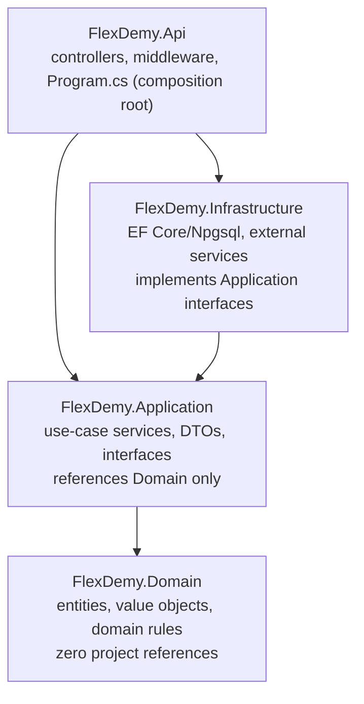
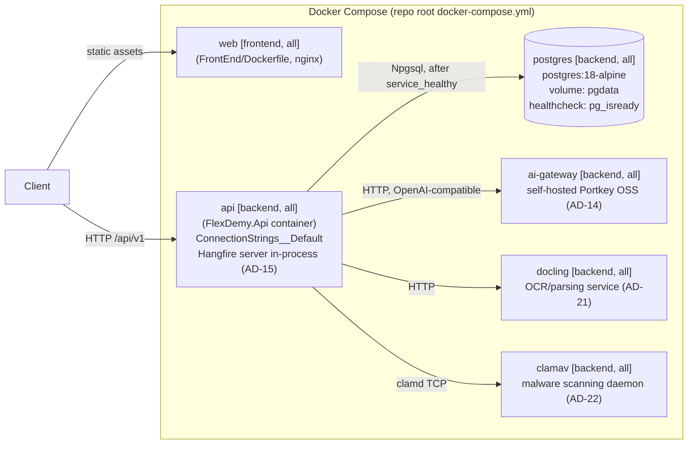

# Architecture Spine — FlexDemy Backend

## Design Paradigm

**Clean Architecture (Onion).** Four projects, dependencies point inward only — nothing in an inner ring may reference an outer ring.



- **Domain** — entities, value objects, domain invariants. No framework, no EF Core attributes, no project references.
- **Application** — use-case interfaces and their implementations (plain service classes, not a mediator pipeline — see AD-3), DTOs, repository/external-service interfaces. References Domain only.
- **Infrastructure** — EF Core `DbContext`, `IEntityTypeConfiguration<T>` mappings, repository implementations, external service clients. Implements Application's interfaces.
- **Api** — controllers, middleware, `Program.cs`. The only project allowed to reference Infrastructure, and only to wire dependency injection.

## Invariants & Rules

### AD-1 — Dependency direction is inward-only [ASSUMPTION]

- **Binds:** all four projects
- **Prevents:** a controller or use-case reaching straight into EF Core/Postgres, and Domain acquiring a framework dependency
- **Rule:** `FlexDemy.Domain` has zero project references. `FlexDemy.Application` references only `FlexDemy.Domain`. `FlexDemy.Infrastructure` references `FlexDemy.Application` (+ `Domain` transitively) and implements its interfaces. `FlexDemy.Api` references `FlexDemy.Application` and `FlexDemy.Infrastructure`. No other direction is permitted.

### AD-2 — Composition root is the only place DI is wired [ASSUMPTION]

- **Binds:** dependency injection registration
- **Prevents:** Infrastructure types (`DbContext`, EF entities-as-DTOs) leaking into Application or Api method signatures, and DI registration scattered across multiple files
- **Rule:** all `services.AddScoped<IX, X>()`-style registrations live in `FlexDemy.Api/Program.cs` (or `DependencyInjection.cs` extension methods called from it, one per project — `AddApplication()`, `AddInfrastructure()`). Application and Infrastructure code never new-up a concrete cross-layer dependency directly; everything arrives via constructor injection.

### AD-3 — No mediator/CQRS-pipeline library [ADOPTED]

- **Binds:** Application layer structure
- **Prevents:** encumbering the project with MediatR 13+'s RPL-1.5 copyleft/commercial license (free tier caps at $5M revenue and $10M outside capital raised) for a project whose commercial scale isn't yet known
- **Rule:** Application exposes plain `I{Feature}Service` interfaces with a matching `{Feature}Service` implementation, called directly by controllers via constructor injection. No mediator, no command/query pipeline behaviors.

### AD-4 — Repository + Unit of Work behind Application interfaces [ASSUMPTION]

- **Binds:** all data access
- **Prevents:** EF Core-specific types or query patterns leaking into Domain/Application, and controllers or services touching `DbContext` directly
- **Rule:** Application defines `I{Entity}Repository` and `IUnitOfWork` interfaces; Infrastructure implements them against EF Core. Domain entities are persistence-ignorant POCOs — no EF Core attributes. Table/column/relationship mapping lives in Infrastructure as one `IEntityTypeConfiguration<T>` class per entity, never data annotations on the entity itself. Infrastructure registers `EFCore.NamingConventions` (`UseSnakeCaseNamingConvention()`, package `EFCore.NamingConventions` 10.0.1) once on the `DbContext`, so PascalCase C# properties map automatically to the PRD's snake_case SQL schema (`course_notes`, `tutor_id`, …) without per-property `.HasColumnName()` calls.

### AD-5 — API conventions [ASSUMPTION]

- **Binds:** `FlexDemy.Api` controllers and Application DTOs
- **Prevents:** inconsistent error shapes and controllers accumulating business logic that belongs in Application
- **Rule:** controllers are thin — HTTP ↔ DTO mapping and calling one Application service method, nothing else. Routes are versioned `/api/v1/{resource}` (matching `BACKEND_PRD.md`'s existing shapes). Errors return RFC 7807 `ProblemDetails` (ASP.NET Core's built-in `AddProblemDetails()`), never a bespoke error envelope — Application-layer failures reach this boundary as exceptions (see AD-10), caught by one global exception-handling middleware that maps each exception type to its `ProblemDetails` status code. DTOs are named `{Entity}Dto` for reads, `Create{Entity}Request` / `Update{Entity}Request` for writes.

### AD-6 — Feature-folder organization within each layer [ASSUMPTION]

- **Binds:** internal folder structure of Domain, Application, Infrastructure
- **Prevents:** a single flat `Services/` or `Interfaces/` folder with no feature boundary as the codebase grows
- **Rule:** each layer is organized by feature area, not by type — e.g. `Application/Courses/{ICourseService.cs, CourseService.cs, CourseDto.cs}`, `Application/Tutoring/`, `Application/Notes/`, `Application/Reviews/`, `Application/Users/`. Mirrors the same feature-folder philosophy already adopted on the frontend, so both halves of the stack read the same way. See AD-12 for the reference rule *between* feature folders.

### AD-7 — Testing conventions [ASSUMPTION]

- **Binds:** all test projects
- **Prevents:** untested Application/Infrastructure logic, and accidentally depending on a now-commercial testing library
- **Rule:** xUnit as the test framework, `NSubstitute` for mocking (BSD-3-Clause — avoids Moq's reputational baggage), xUnit's built-in `Assert` for assertions (avoids FluentAssertions 8+'s commercial license; `AwesomeAssertions`, its free Apache-2.0 fork, is an acceptable opt-in upgrade later, never plain FluentAssertions ≥8). One test project per layer mirroring `src/` — `FlexDemy.Application.Tests`, `FlexDemy.Infrastructure.Tests`, `FlexDemy.Api.Tests` — using .NET's standard parallel-tree convention (not the frontend's file-colocation convention; this is a deliberate per-ecosystem difference).

### AD-8 — Migration strategy [ASSUMPTION]

- **Binds:** database schema evolution
- **Prevents:** two developers independently deciding how/when migrations apply, silent schema drift between environments, and `ModelSnapshot.cs` merge collisions
- **Rule:** EF Core Migrations live in `FlexDemy.Infrastructure/Persistence/Migrations`, authored via `dotnet ef migrations add` run against the Api project, using an explicit `FlexDemyDbContextFactory : IDesignTimeDbContextFactory<FlexDemyDbContext>` in `FlexDemy.Infrastructure/Persistence/` (never relying on `dotnet ef`'s implicit host discovery). Applied on startup only when the `RUN_MIGRATIONS_ON_STARTUP` environment variable is `true` (set in `docker-compose.yml` and local dev; unset/false everywhere else) — checked explicitly in `Program.cs`, deliberately decoupled from `ASPNETCORE_ENVIRONMENT` (which defaults to `Production` inside a plain container, so gating on `IsDevelopment()` would silently never fire under Docker Compose). Process note: only one engineer adds a migration at a time against latest `main`.

### AD-9 — Entity ID strategy [ASSUMPTION]

- **Binds:** all entity primary keys
- **Prevents:** two engineers independently choosing GUID vs. auto-increment int vs. ad-hoc string ids for new entities
- **Rule:** IDs are `string`, matching the PRD's `VARCHAR(64)` columns, generated application-side via an `IIdGenerator` interface defined in Application and implemented in Infrastructure — never database-generated (no `SERIAL`/`IDENTITY`). The implementation (`GuidV7IdGenerator`) uses `Guid.CreateVersion7()` (RFC 9562, time-ordered, built into .NET since .NET 9) rather than a third-party ULID package — same sortability property, zero extra dependency. Every new aggregate root's `Id` is assigned via `IIdGenerator.NewId()` before construction.

### AD-10 — Service DTO boundary and mapping ownership [ASSUMPTION]

- **Binds:** every Application service
- **Prevents:** controllers doing their own ad-hoc mapping, and Domain entities leaking into Api-layer JSON responses
- **Rule:** every `I{Feature}Service` method accepts and returns DTOs only at its public signature — Domain entities never cross out of Application. Mapping happens inside the service implementation via a static `{Entity}Mapper` class (`ToDto`/`ToEntity` methods) colocated in the same feature folder. No AutoMapper — it went commercial alongside MediatR (same author, same 2026 licensing shift as AD-3).

### AD-11 — Transaction and commit ownership [ASSUMPTION]

- **Binds:** all write use-cases
- **Prevents:** partial-commit bugs when a use-case touches two repositories, and repositories silently committing before a use-case's business rules finish validating
- **Rule:** only the Application service method calls `IUnitOfWork.SaveChangesAsync()`, exactly once per use-case, after every repository call for that use-case has staged its change. Repositories only stage changes (`Add`/`Update`/`Remove` via `DbContext`) — they never call `SaveChangesAsync` themselves.

### AD-12 — Cross-feature-folder reference rule [ASSUMPTION]

- **Binds:** Application-layer feature folders (extends AD-6)
- **Prevents:** a feature bypassing another feature's validation/business rules by reaching straight into its data access
- **Rule:** a feature's service (e.g. `TutorService`) may depend on another feature's **service interface** (e.g. `ICourseService`) to reuse its business rules, but must never depend on another feature's **repository interface** directly (e.g. `TutorService` must not inject `ICourseRepository`).

### AD-13 — Docker deployment envelope [ASSUMPTION, UPDATED]

- **Binds:** the deployment/operational envelope, across both BackEnd and FrontEnd
- **Prevents:** two engineers inventing different connection-string env var names, the API container starting before Postgres can accept connections, and the frontend/backend deploy paths silently diverging into two un-synced compose files
- **Rule:** `docker-compose.yml` lives at the **repo root** (not `BackEnd/`), defining three services — `postgres`, `api` (build context `./BackEnd`, `src/FlexDemy.Api/Dockerfile`), `web` (build context `./FrontEnd`, its own `Dockerfile`, static Vite build served by nginx). Every service carries a Compose **profile** tag: `postgres`/`api` → `["backend", "all"]`, `web` → `["frontend", "all"]` — so `docker compose --profile backend up`, `--profile frontend up`, and `--profile all up` deploy backend-only, frontend-only, and everything together from the one file, per explicit user requirement. `FlexDemy.Api/Dockerfile` is a multi-stage build (`mcr.microsoft.com/dotnet/sdk:10.0` to restore+publish, `mcr.microsoft.com/dotnet/aspnet:10.0` to run); `FrontEnd/Dockerfile` is likewise multi-stage (`node:24-alpine` to build, `nginx:stable-alpine` to serve, with an SPA-fallback `nginx.conf`). `api` reads its connection string from `ConnectionStrings__Default` (ASP.NET's standard double-underscore env-var config convention — not a bespoke key); `postgres` uses a named volume mounted at `/var/lib/postgresql` (not `.../data` — the pg 18+ image refuses to start against the pre-18 mount convention, confirmed live) for persistence and a `pg_isready` healthcheck; `api`'s `depends_on` requires `postgres`'s `service_healthy` condition, not just container start.
- **Known environment limitation (not a spine defect):** in this project's current dev machine, `docker compose --profile backend build` fails at `dotnet restore` inside the SDK image with `NU1301 UntrustedRoot` reaching `api.nuget.org` — a local network/corporate-proxy TLS-interception characteristic of that machine, reproduced twice, non-transient. `dotnet build`/`dotnet test` on the host (outside Docker) and the `web` image's Docker build both succeed cleanly, isolating the failure to that one container's outbound TLS trust chain. Typical fix is trusting the org's root CA inside the SDK build stage or pointing NuGet at an internal proxy — an environment fix, not a Dockerfile or code change.
- **Hangfire note (AD-15):** Hangfire's server runs in-process inside the existing `api` container (`app.UseHangfireServer()` in `Program.cs`) against the existing Postgres instance. No new Docker Compose service and no Redis — the publish-job worker is not a separate deployable.
- **Cost-review addition (2026-08-11) — three new services, all `["backend", "all"]` profile:** `ai-gateway` (self-hosted Portkey OSS gateway, AD-14 — a standalone lightweight proxy, not embeddable in-process, unlike Hangfire above), `docling` (OCR/document-parsing microservice, AD-21 — Python-native, wrapped as its own small HTTP service since Docling has no .NET binding), and `clamav` (ClamAV daemon, AD-22, official `clamav/clamav` image, connected to over its `clamd` TCP socket). `api` reaches all three over the Compose internal network by service name (`http://ai-gateway:8787`, `http://docling:PORT`, `clamav:3310`) — none are exposed externally. This grows the envelope from 3 services to 6; still one `docker-compose.yml`, same profile-tag discipline as the rule above.

### AD-14 — AI Service Layer via `IAiGateway` [ASSUMPTION]

- **Binds:** all AI-calling code (course extraction/authoring, drilldown, exercises, keyword/notation content)
- **Prevents:** each feature (Courses, future Drilldown/Exercises) writing its own ad-hoc AI HTTP client, and AI-provider request/response specifics leaking into feature services
- **Rule:** one fat `IAiGateway` interface — not per-task interfaces, matching the PRD's FR-1 framing of a single internal AI-service layer — lives in a new cross-cutting `Application/AiGateway/` folder, at the same tier as `Common/` (extending AD-6's feature-folder pattern to a shared, no-single-owner concern). One method per AI Task: `ExtractStructureAsync`, `ExplainTopicAsync`, `RewriteExplanationAsync`, `GenerateExerciseAsync`, `DefineKeywordAsync`, `DescribeNotationAsync`, plus an embeddings method. The HTTP-calling implementation lives in `Infrastructure/AiGateway/` and implements `IAiGateway`, targeting a **self-hosted Portkey OSS gateway** (`portkey-ai/gateway`, Apache-2.0, web-verified Aug 2026 — decided in cost review over a managed OpenRouter/Portkey-hosted tier specifically because self-hosting carries zero inference markup, not just for data residency) at `http://ai-gateway:8787` per AD-13's deployment note — this replaces the PRD's original managed-then-self-hosted phasing with one gateway from day one, so `Infrastructure/AiGateway/`'s implementation targets that one endpoint shape permanently, not a phase-1 and a phase-2 shape. DI registration follows AD-2 (wired in `Program.cs`/`AddInfrastructure()`, never new'd up directly by a feature service). `DescribeNotationAsync` runs inside the per-node extraction/authoring pipeline, not the publish-time batch job (AD-15) — alt-text is an authoring-time accessibility requirement (FR-16), not publish-gated content like Drill-Down/Ways. Per-task fallback (PRD FR-3) is implemented with **Polly 8.7.0** (BSD-3-Clause, App vNext — web-verified Aug 2026; no license-risk overlap with AD-3's concerns) as a fallback policy wrapping each `IAiGateway` method's primary-provider call, falling back to that task's configured secondary provider/model on failure; the fallback event is logged via the same usage-tracking path as AD-18's budget counter (PRD FR-4).

### AD-15 — Async batch job execution via Hangfire [ADOPTED]

- **Binds:** the course-publish workflow (course → `Publishing` sub-state, ~200+ AI calls per batch) **and** the file upload/parsing/extraction pipeline (FR-11–13) — both are the identical shape (per-item async work, independent status, independent retry), so both use the same job mechanism rather than two.
- **Prevents:** a synchronous HTTP request blocking on many sequential AI/parsing calls, publish or extraction progress being lost if the initiating tab closes, and a second, differently-built async mechanism for extraction just because it was scoped in a separate PRD section
- **Rule:** Hangfire Core + Hangfire.PostgreSql (LGPLv3; different author/company than MediatR/AutoMapper, so no license-risk overlap with AD-3's MediatR rejection) run both the publish batch and per-file extraction, using the existing Postgres instance as the job store — no new datastore, no Redis. One Hangfire job per content-node generation call (publish) or per uploaded file (extraction), not one job for the whole batch, so per-item status is tracked individually, the job survives tab-close (it runs server-side regardless of client connection), and a failed item is retryable on its own without re-running the whole batch. Chosen over a hand-rolled `BackgroundService` + Postgres jobs table (`SELECT ... FOR UPDATE SKIP LOCKED`) for its built-in retry/dashboard machinery at this batch size, and over Quartz.NET (cron/scheduler-centric, a heavier fit for recurring jobs than a one-off burst). **Status is a Domain-level contract, not a Hangfire-level one:** a single `JobItemStatus` enum (`Queued`, `InProgress`, `Done`, `Failed`) lives in `Domain/Jobs/`, set on the owning entity (a node's generation record, a file's extraction record) by the job handler itself as it progresses — never read by querying Hangfire's own `IMonitoringApi`/dashboard state from Application or Api (that would violate AD-1's data-access boundary). Hangfire's own job IDs and monitoring API stay entirely inside `Infrastructure/Jobs/`; nothing outside that folder references a Hangfire type.

### AD-16 — Batch job-item commits are an AD-11 carve-out, and batch-completion is a claimed last-item [ASSUMPTION]

- **Binds:** the publish use-case **and** the extraction use-case, and both's Hangfire job items (extends AD-11 and AD-15)
- **Prevents:** reading AD-11's "one `SaveChangesAsync` per use-case" rule as forbidding either batch's many independent per-item commits (or, conversely, batch code buffering all items into one giant transaction just to satisfy AD-11's letter); and — the gap a fresh adversarial read exposed — leaving "when does the batch as a whole finish" undefined, so two engineers could each assume they own transitioning the course out of `Publishing` (or a file-set out of its extraction phase)
- **Rule:** the use-case that triggers Publish (or a file-set's extraction) still obeys AD-11 as written — it calls `SaveChangesAsync` exactly once, transitioning the course to `Publishing` (or the file-set to its in-progress state). Each Hangfire job item, however, commits its own generated content independently as it completes; this is a different use-case shape (a fire-and-forget batch of many small independent units of work, not one synchronous unit of work) and is not a violation of AD-11's spirit. **Batch completion — the step that flips `Publishing → Published` and finalizes AD-17's version snapshot — is claimed by whichever job item's completion causes an atomic `UPDATE ... SET remaining = remaining - 1 WHERE batch_id = ... RETURNING remaining` (on a `PublishBatch`/`ExtractionBatch` row created alongside the batch) to return `0`.** Only that one item runs the finalize step; every other item's completion is a no-op past its own commit. This avoids a two-jobs-both-think-they're-last race without needing Hangfire Pro's (commercial) batch-continuation feature. Job/batch IDs follow AD-9 — `string` IDs via the existing `IIdGenerator`, same pattern as every other entity, no separate ID scheme for jobs.

### AD-17 — FR-25 version storage is a deep-copy snapshot [ASSUMPTION]

- **Binds:** course publish/versioning
- **Prevents:** building a diff/audit-log or event-replay engine when FR-25 only asks for restorable versions
- **Rule:** each publish deep-copies the entire confirmed content tree plus its cached Drill-Down/Way content into a versioned snapshot. Restoring a prior version swaps an active-version pointer to that snapshot — it is not a diff/replay engine. Chosen for simplicity and literal match to FR-25's wording over storage efficiency, accepting the storage cost at this stage.

### AD-18 — Budget enforcement is a pre-flight atomic reserve against AD-19's threshold, not post-hoc recording [ASSUMPTION]

- **Binds:** AI-task budget/spend tracking and enforcement (FR-29)
- **Prevents:** a cached running total drifting from actual spend under concurrent AI calls; the added complexity of periodic reconciliation; and — the gap a fresh read exposed — recording spend only *after* a call, which fails FR-29's explicit requirement to block a request *before* it exceeds budget; and `AiTaskBudget` drifting from `AiTaskConfig.budget_threshold` (AD-19) if the threshold were duplicated onto the spend row instead of read from its one owning table
- **Rule:** `AiTaskBudget` (in `Domain/AiUsage/`) holds only `spent`, never its own copy of the threshold. Before dispatching an `IAiGateway` call, the caller runs `UPDATE ai_task_budget SET spent = spent + cost WHERE task_id = ... AND spent + cost <= (SELECT budget_threshold FROM ai_task_config WHERE task_id = ai_task_budget.task_id) RETURNING spent` — a single atomic statement that reserves spend against AD-19's live threshold and blocks (zero rows returned) *before* the call happens, not a cached running total with periodic reconciliation. Right for this project's stated scale (single container, moderate volume); reconciliation's eventual-consistency complexity isn't earned yet.

### AD-19 — AI task configuration is DB-backed, not static config files [ASSUMPTION]

- **Binds:** per-task provider/model assignment, fallback assignment, budget thresholds, and prompt text/version (PRD FR-2, FR-5, FR-27, FR-28)
- **Prevents:** the PRD's "no redeploy" guarantee (FR-2, FR-29) silently breaking once the gateway moves to a self-hosted phase-2 provider whose native config is a static file requiring a process restart to change; and Admin's read/write config UI (FR-27, FR-28) having no backing store to read from or write to
- **Rule:** a new `Domain/AiConfig/` entity set (`AiTaskConfig` — one row per AI Task, holding active provider/model, fallback provider/model, budget threshold; `AiPromptVersion` — versioned prompt text per task, append-only per AD-11's Repository/UnitOfWork discipline) is the single source of truth for gateway behavior, read by `Infrastructure/AiGateway/`'s implementation at request time (not baked into `appsettings.json`). `Application/AiConfig/` exposes `IAiConfigService` (CRUD on task config, list/activate prompt versions) per AD-2/AD-10's DTO-boundary convention; `Api/Controllers/AiConfigController.cs` exposes it to Admin. A config or prompt-version change takes effect on the next `IAiGateway` call with no redeploy, because Infrastructure reads from the DB, never from a file loaded once at startup.

### AD-20 — Course content tree is four explicit entity types, not a generic node table [ASSUMPTION]

- **Binds:** `Domain/Courses/`, and every AD above that references "the confirmed content tree" (AD-14's `ExtractStructureAsync`, AD-16's batch-completion finalize, AD-17's deep-copy snapshot)
- **Prevents:** the PRD's Chapter→Topic→Subtopic→Content-Block hierarchy going unmodeled (a gap a fresh review caught: nothing in this spine defined it, and the Structural Seed's `Domain/Courses/` line still named the superseded Dashboard-PRD `Module`/`Lesson` shape) — and, separately, two engineers each picking a different generic-vs-explicit representation (a single polymorphic `Node` table with a `NodeType` discriminator vs. four typed entities) with no rule to converge on
- **Rule:** `Chapter`, `Topic`, `Subtopic`, and `ContentBlock` are four explicit entity types in `Domain/Courses/` (not a single generic/EAV-style `Node` table with a type discriminator) — each with its own parent-FK reference one level up the hierarchy (`Topic.ChapterId`, `Subtopic.TopicId`, `ContentBlock.SubtopicId` or `.TopicId` directly, since FR-3's Glossary allows a Content Block under either), matching Domain's existing "explicit entities, not a generic shape" pattern (AD-1's own framing). This supersedes the prior `Module`/`Lesson` entities entirely — the New Course Wizard PRD's own Document Purpose states it "replaces that flow end to end"; `Module`/`Lesson` are not kept as a parallel or legacy shape. `JobItemStatus` (AD-15) and confirmation state (per-node, tutor-set) are fields on these entities, not a separate tracking table. `CourseVersion` (AD-17) is a deep-copy snapshot of this same four-entity tree, not a structurally different representation.

### AD-21 — Document parsing via a self-hosted Docling service [ASSUMPTION]

- **Binds:** FR-12's parsing/OCR pre-step, ahead of `IAiGateway.ExtractStructureAsync` (AD-14)
- **Prevents:** paying a per-page SaaS parsing fee (e.g. LlamaParse) that scales with upload volume, when a free, self-hosted, MIT-licensed option (Docling) covers the same job — decided in cost review, 2026-08-11
- **Rule:** Docling (IBM, MIT, web-verified Aug 2026) runs as its own lightweight HTTP service (`docling`, AD-13) since it's Python-native with no .NET binding — `Infrastructure/Parsing/` gets a small HTTP client calling it, analogous in shape to `Infrastructure/AiGateway/`'s client. Docling's pluggable OCR backends (EasyOCR/Tesseract/RapidOCR, all free/permissive) handle FR-12's scanned-page case, not just clean digital-born PDFs. FR-12's existing confidence-threshold gate (routing low-confidence output to failed/retry rather than passing it through) is the accepted mitigation for Docling being less accurate than a paid alternative on heavily degraded scans — a product-level trade-off already made in the PRD, not re-opened here.

### AD-22 — Malware scanning via a self-hosted ClamAV service [ASSUMPTION]

- **Binds:** FR-11's upload-scanning requirement, ahead of AD-21's parsing step
- **Prevents:** paying for a commercial scanning API when a free, actively-maintained, open-source scanner covers this small-scale, tutor-only upload surface — decided in cost review, 2026-08-11
- **Rule:** ClamAV (Cisco-Talos, GPLv2, official `clamav/clamav` Docker image, web-verified Aug 2026) runs as its own service (`clamav`, AD-13), reached over its `clamd` TCP protocol — `Infrastructure/Scanning/` gets a client (e.g. an `nClam`-class .NET ClamAV client, `[ASSUMPTION: exact client library not yet chosen — confirm before build]`) implementing an `IFileScanner` interface defined in `Application/Common/`. A file failing the scan is rejected at FR-11's upload step with a specific reason, before ever reaching AD-21's parsing step. ClamAV's documented lower detection rate on novel/obfuscated malware (vs. commercial engines) is an accepted trade-off at this upload surface's scale and threat profile — supplementing with a free third-party signature feed (e.g. SaneSecurity) is a future hardening option, not required for launch.

### AD-23 — Correlation ID: ambient accessor for the HTTP path, explicit job parameter for the async path [ASSUMPTION]

- **Binds:** FR-20/FR-21/FR-22 (`prd-eLearning-ErrorObservability-2026-08-13`)
- **Prevents:** two engineers picking incompatible propagation mechanisms — one threading an explicit `correlationId` parameter through every method call, another reaching for `HttpContext.Items` directly inside an Application service (which would violate AD-1: Application/Domain must never reference `HttpContext`) — and, separately, silently assuming ambient request state survives into a Hangfire job's execution when it structurally cannot (a job runs on Hangfire's own server loop, on a different thread, with no relationship to the enqueuing request's async-flow context).
- **Rule:** a new `Application/Common/ICorrelationIdAccessor` interface (`Current` getter, `Set(...)`) is the only sanctioned way to read or set the correlation ID — implemented in Infrastructure via an `AsyncLocal<string?>`-backed accessor, so it survives `await` boundaries within one request without being threaded as an explicit parameter through every intermediate call. A new `CorrelationIdMiddleware` in Api reads the inbound `X-Correlation-Id` header (or generates a GUID if absent), calls `ICorrelationIdAccessor.Set(...)`, and echoes it back on the response — registered **before** `ExceptionHandlingMiddleware` (AD-5's extension point) so an exception always has an ID to attach by the time it's caught. For the async path (extends AD-15): each `I{X}JobEnqueuer` method gains an explicit `correlationId` parameter, captured from `ICorrelationIdAccessor.Current` by the *calling* Application service at enqueue time and forwarded as an explicit `BackgroundJob.Enqueue<IXJob>(j => j.RunAsync(id, correlationId, CancellationToken.None, null))` argument; the job's `RunAsync` calls `ICorrelationIdAccessor.Set(correlationId)` as its first line, so every downstream capture call within that job's execution picks it up through the same accessor as the HTTP path — never derived independently inside the job. `[ASSUMPTION: mints its own GUID rather than reusing ASP.NET Core's built-in HttpContext.TraceIdentifier, to avoid coupling this feature's identifier semantics to a framework-internal value that can serve other purposes — confirm before build if reuse is preferred instead.]`

### AD-24 — Centralized error capture behind one `IErrorCaptureService`, never per-site duplication [ASSUMPTION]

- **Binds:** FR-1, FR-3, FR-6/FR-7, FR-8, FR-9, FR-10, FR-19 (`prd-eLearning-ErrorObservability-2026-08-13`)
- **Prevents:** FR-1's global exception middleware, FR-3's 4 job terminal-failure sites, and FR-6/FR-7's frontend-reporting path each independently reimplementing fingerprint hashing, category-mapping, or priority rules — a real risk of the four sites drifting (e.g. one site's fingerprint hash normalizes a stack trace differently than another's), silently breaking FR-8's "one row per distinct Fingerprint" dedup guarantee. Also prevents FR-7's deliberately-anonymous reporting endpoint from landing under FR-19's Master-only class-level policy — the exact conflict the PRD's own reviewer gate caught and fixed at the requirements level; encoding the two-controller split here stops it from recurring at build time.
- **Rule:** a new `ErrorObservability` feature folder (AD-6 shape, spanning Domain/Application/Infrastructure/Api like `Courses`/`Tutoring`) exposes `Application/ErrorObservability/IErrorCaptureService` with one method, `CaptureAsync(ErrorCaptureRequest)`, owning fingerprinting (FR-8), rule-based categorization (FR-9), and rule-based priority assignment (FR-10 Phase A/B) in one place — matching AD-3's plain-service pattern, no mediator. All 4 capture sites call this one service; none reimplements the logic. It internally swallows its own failures (the PRD's own NFR: a failure writing an ErrorRecord must be swallowed, not thrown, so observability never becomes a second source of outages). Exposed over **two** controllers, never one: an anonymous `ErrorReportingController` (FR-7, `POST /api/v1/errors/client`, no `[Authorize]`) and a Master-gated `ErrorsController` (FR-11–FR-18, FR-24, `[Authorize(Policy = FeatureKeys.ErrorsManage)]` at class level, per AD-5's controller convention).

## Consistency Conventions

| Concern | Convention |
| --- | --- |
| Naming | Standard .NET: `PascalCase` types/members/namespaces, `camelCase` locals/parameters, interfaces prefixed `I` |
| Namespaces | `FlexDemy.{Layer}.{Feature}`, matching folder path (e.g. `FlexDemy.Application.Courses`) |
| DTOs | `{Entity}Dto` (read), `Create{Entity}Request` / `Update{Entity}Request` (write) — never expose Domain entities directly over HTTP (AD-10) |
| Errors | RFC 7807 `ProblemDetails` only, via ASP.NET Core's built-in middleware; Application signals failure via `AppException` subtypes (AD-5) |
| Config & secrets | `appsettings.{Environment}.json` + environment-variable overrides (`ConnectionStrings__Default`, `RUN_MIGRATIONS_ON_STARTUP`) for connection strings/secrets; `appsettings.Development.json` never commits a real secret — local dev uses `dotnet user-secrets` or a gitignored `.env` consumed by Docker Compose |
| Async | All I/O-bound methods are `async`/`await` end-to-end (repositories, services, controllers) — no sync-over-async |
| Tests | One test project per `src/` layer, xUnit + NSubstitute (BSD-3-Clause), namespace-mirrored folders |
| Entity IDs | `string` ULIDs via `IIdGenerator`, never DB-generated (AD-9) |

## Stack

| Name | Version |
| --- | --- |
| .NET / ASP.NET Core | 10 (current LTS, supported through Nov 2028 — web-verified Aug 2026) |
| C# | 14 (ships with .NET 10) |
| Npgsql.EntityFrameworkCore.PostgreSQL | 10.0.3 (requires `Microsoft.EntityFrameworkCore` ≥10.0.4 <11.0.0 — web-verified Aug 2026) |
| EFCore.NamingConventions | 10.0.1 (snake_case mapping for EF Core 10 — web-verified Aug 2026) |
| PostgreSQL | 18 (18.4 latest stable; 19 still in beta — web-verified Aug 2026), `postgres:18-alpine` in Docker |
| xUnit | latest stable (standard .NET test framework) |
| NSubstitute | latest stable (BSD-3-Clause) |
| Docker / Docker Compose | latest stable |
| Hangfire (Core) | 1.8.24 (LGPLv3 — web-verified Aug 2026) |
| Hangfire.PostgreSql | 1.21.1 (Postgres-backed job store, no Redis needed — web-verified Aug 2026) |
| Polly | 8.7.0 (BSD-3-Clause, App vNext — web-verified Aug 2026; AD-14's per-task fallback) |
| Portkey OSS gateway | `portkey-ai/gateway` (Apache-2.0 — web-verified Aug 2026; AD-14, self-hosted, zero inference markup) |
| Docling | IBM, MIT (web-verified Aug 2026; AD-21, self-hosted OCR/parsing service) |
| ClamAV | Cisco-Talos, GPLv2, `clamav/clamav` Docker image (web-verified Aug 2026; AD-22, self-hosted malware scanning) |
| .NET ClamAV client | `[ASSUMPTION: exact package not yet chosen (e.g. an nClam-class library) — confirm before build]` |

## Structural Seed

```text
{repo root}/
  docker-compose.yml           # postgres + api + web, Compose profiles (AD-13) -- root, not BackEnd/
  FrontEnd/
    Dockerfile                  # node:24-alpine build -> nginx:stable-alpine serve
    nginx.conf
    ...                         # see the frontend ARCHITECTURE-SPINE.md for FrontEnd/src structure

  BackEnd/
  src/
    FlexDemy.Domain/
      Courses/            # Course entity; Chapter/Topic/Subtopic/ContentBlock tree (AD-20, supersedes the old Module/Lesson shape); CourseVersion (deep-copy publish snapshot, AD-17)
      Tutoring/            # TutorSlot entity
      Notes/               # CourseNote entity
      Reviews/             # CourseReview entity
      Users/               # User entity
      Jobs/                 # JobItemStatus enum (AD-15); PublishBatch, ExtractionBatch (AD-16's claimed-last-item finalize)
      AiUsage/             # AiTaskUsage, AiTaskBudget entities (FR-29 spend tracking, AD-18)
      AiConfig/             # AiTaskConfig, AiPromptVersion entities (AD-19)
      Tags/                 # Tag entity (FR-26, net-new -- not part of the taxonomy/Master Data scaffold)
      ErrorObservability/   # ErrorRecord entity (Fingerprint, Category, Priority, Status, CorrelationId, AD-23/AD-24)
      FlexDemy.Domain.csproj

    FlexDemy.Application/
      Courses/             # ICourseService, CourseService, CourseMapper, CourseDto, Create/UpdateCourseRequest, ICourseRepository
      Tutoring/             # ITutorService, TutorService, TutorMapper, TutorSlotDto, ITutorSlotRepository
      Notes/                # INoteService, NoteService, NoteMapper, NoteDto, ICourseNoteRepository
      Reviews/              # IReviewService, ReviewService, ReviewMapper, ReviewDto, ICourseReviewRepository
      Users/                # IUserService, UserService, UserMapper, UserDto, IUserRepository
      AiGateway/            # IAiGateway (one method per AI Task, AD-14) + request/response DTOs
      AiConfig/              # IAiConfigService (AD-19): task provider/model/fallback/budget CRUD, prompt version list/activate
      Tags/                  # ITagService, TagService, TagMapper, TagDto, ITagRepository (FR-26)
      Common/               # IUnitOfWork, IIdGenerator, IFileScanner (AD-22), ICorrelationIdAccessor (AD-23), AppException + subtypes, pagination/result wrappers
      ErrorObservability/    # IErrorCaptureService (AD-24): fingerprinting + FR-9 categorization + FR-10 priority, ErrorRecordDto, admin CRUD/lifecycle service
      FlexDemy.Application.csproj

    FlexDemy.Infrastructure/
      Persistence/
        FlexDemyDbContext.cs
        FlexDemyDbContextFactory.cs   # IDesignTimeDbContextFactory<FlexDemyDbContext>
        Migrations/
        Configurations/      # one IEntityTypeConfiguration<T> per entity
      Repositories/           # CourseRepository, TutorSlotRepository, etc. — implement Application interfaces
      IdGeneration/            # UlidIdGenerator : IIdGenerator
      AiGateway/               # HTTP client implementing IAiGateway, targets self-hosted Portkey OSS gateway (AD-14)
      Parsing/                 # HTTP client calling the self-hosted Docling service (AD-21)
      Scanning/                # ClamAV client implementing IFileScanner (AD-22)
      Jobs/                    # Hangfire job classes, one per content-node generation call (AD-15)
      Correlation/             # AsyncLocal-backed ICorrelationIdAccessor implementation (AD-23)
      ErrorObservability/      # EF Core repository for ErrorRecord (AD-24)
      DependencyInjection.cs  # AddInfrastructure(this IServiceCollection, IConfiguration)
      FlexDemy.Infrastructure.csproj

    FlexDemy.Api/
      Controllers/
        CoursesController.cs
        TutorController.cs
        NotesController.cs
        ReviewsController.cs
        UsersController.cs
        AiConfigController.cs    # AD-19: Admin-facing task config/prompt-version/usage read+write
        TagsController.cs        # FR-26
        ErrorsController.cs         # AD-24: Master-gated, FR-11-FR-18 + FR-24 trace view, [Authorize(Policy = FeatureKeys.ErrorsManage)]
        ErrorReportingController.cs # AD-24: anonymous, FR-7 POST /api/v1/errors/client only, no [Authorize]
      Middleware/
        ExceptionHandlingMiddleware.cs   # maps AppException subtypes -> ProblemDetails
        CorrelationIdMiddleware.cs       # AD-23: registered before ExceptionHandlingMiddleware
      Program.cs               # composition root: AddApplication() + AddInfrastructure() + middleware pipeline + RUN_MIGRATIONS_ON_STARTUP check + UseHangfireServer() (AD-15)
      appsettings.json
      appsettings.Development.json
      Dockerfile
      FlexDemy.Api.csproj

  tests/
    FlexDemy.Application.Tests/
    FlexDemy.Infrastructure.Tests/
    FlexDemy.Api.Tests/

  FlexDemy.slnx                 # .NET 10's XML solution format
```



## Deferred

- **WebSocket real-time protocols** (`BACKEND_PRD.md` §5: session countdown, synchronous study rooms) — not part of this structure-only scaffold. When implemented, ASP.NET Core's native `WebSocket`/SignalR support is the natural fit within the existing Api project; revisit then.
- **Redis** (rate limiting, WebSocket session state per the PRD) — not provisioned in this pass. Add as a `docker-compose.yml` service + an Infrastructure-layer client when rate limiting or real-time state is actually implemented.
- **Hangfire retry/backoff policy** — the exact per-item retry count and backoff interval for a failed publish job item is not decided in this pass (Hangfire ships default retry behavior out of the box); revisit once real failure-rate data from the AI gateway is available.
- **Snapshot storage retention** — AD-17's deep-copy-per-version snapshot has no size-management/retention policy yet (how many versions to keep, whether/when to prune old ones); revisit once storage growth is observed in practice.
- ~~**Auth implementation**~~ — **resolved outside this spine's own passes, not still deferred.** A fresh review caught this Deferred item and the project `CLAUDE.md` both contradicting the live code: `AuthController.cs`, `JwtTokenService.cs` (HMAC-signed JWTs, configurable signing key, dev-only fallback), and `FeatureAuthorizationHandler.cs` already implement login/register/`me` + role-claim-based authorization. Full OAuth2 (vs. this password-based JWT flow) remains genuinely unbuilt if the PRD's OAuth2 mention was meant literally — revisit only that narrower gap, not "auth" as a whole.
- **NGINX reverse proxy on port 3000** (`BACKEND_PRD.md` §7) — not adopted in this pass; explicitly deferred rather than dropped. Revisit once actual deployment topology (cloud provider, TLS termination) is scoped.
- **Production migration strategy** — AD-8's startup auto-migrate is a known anti-pattern at real production scale (concurrent instances racing to migrate); revisit before any production deployment.
- **OpenTelemetry / W3C Trace Context** — AD-23's Correlation ID is a simple app-level GUID threaded through this one service's own requests and jobs, not a `traceparent`-compatible distributed-tracing identifier (matches the ErrorObservability PRD's own Non-Goal). Revisit if FlexDemy ever splits into more independently-deployed services where a real distributed-tracing standard would earn its keep.
- **CI pipeline** — not set up in this pass; revisit once there's a remote to push to and a decision on where CI runs.
