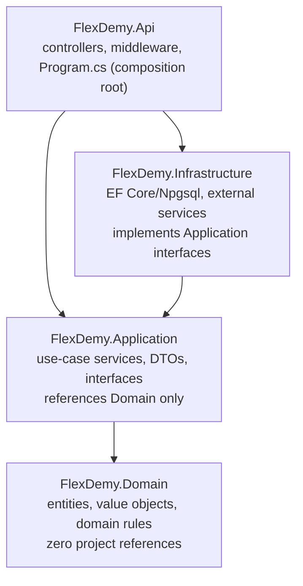
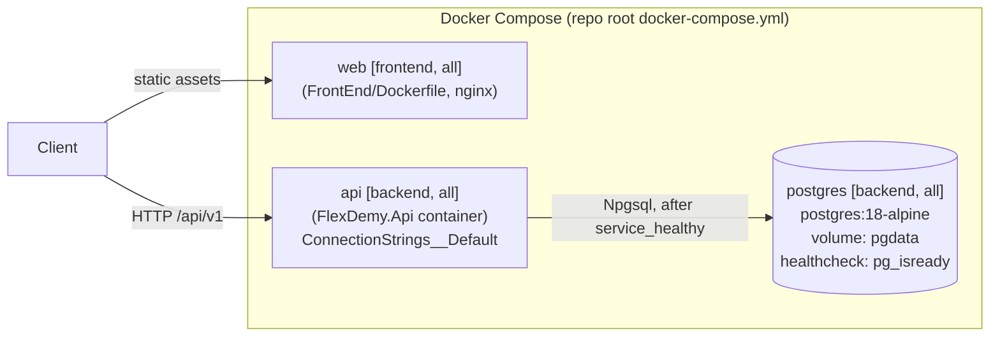

# Architecture Spine — FlexDemy Backend

## Design Paradigm

**Clean Architecture (Onion).** Four projects, dependencies point inward only — nothing in an inner ring may reference an outer ring.



- **Domain** — entities, value objects, domain invariants. No framework, no EF Core attributes, no project references.
- **Application** — use-case interfaces and their implementations (plain service classes, not a mediator pipeline — see AD-3), DTOs, repository/external-service interfaces. References Domain only.
- **Infrastructure** — EF Core `DbContext`, `IEntityTypeConfiguration<T>` mappings, repository implementations, external service clients. Implements Application's interfaces.
- **Api** — controllers, middleware, `Program.cs`. The only project allowed to reference Infrastructure, and only to wire dependency injection.

## Invariants & Rules

### AD-1 — Dependency direction is inward-only [ASSUMPTION]

- **Binds:** all four projects
- **Prevents:** a controller or use-case reaching straight into EF Core/Postgres, and Domain acquiring a framework dependency
- **Rule:** `FlexDemy.Domain` has zero project references. `FlexDemy.Application` references only `FlexDemy.Domain`. `FlexDemy.Infrastructure` references `FlexDemy.Application` (+ `Domain` transitively) and implements its interfaces. `FlexDemy.Api` references `FlexDemy.Application` and `FlexDemy.Infrastructure`. No other direction is permitted.

### AD-2 — Composition root is the only place DI is wired [ASSUMPTION]

- **Binds:** dependency injection registration
- **Prevents:** Infrastructure types (`DbContext`, EF entities-as-DTOs) leaking into Application or Api method signatures, and DI registration scattered across multiple files
- **Rule:** all `services.AddScoped<IX, X>()`-style registrations live in `FlexDemy.Api/Program.cs` (or `DependencyInjection.cs` extension methods called from it, one per project — `AddApplication()`, `AddInfrastructure()`). Application and Infrastructure code never new-up a concrete cross-layer dependency directly; everything arrives via constructor injection.

### AD-3 — No mediator/CQRS-pipeline library [ADOPTED]

- **Binds:** Application layer structure
- **Prevents:** encumbering the project with MediatR 13+'s RPL-1.5 copyleft/commercial license (free tier caps at $5M revenue and $10M outside capital raised) for a project whose commercial scale isn't yet known
- **Rule:** Application exposes plain `I{Feature}Service` interfaces with a matching `{Feature}Service` implementation, called directly by controllers via constructor injection. No mediator, no command/query pipeline behaviors.

### AD-4 — Repository + Unit of Work behind Application interfaces [ASSUMPTION]

- **Binds:** all data access
- **Prevents:** EF Core-specific types or query patterns leaking into Domain/Application, and controllers or services touching `DbContext` directly
- **Rule:** Application defines `I{Entity}Repository` and `IUnitOfWork` interfaces; Infrastructure implements them against EF Core. Domain entities are persistence-ignorant POCOs — no EF Core attributes. Table/column/relationship mapping lives in Infrastructure as one `IEntityTypeConfiguration<T>` class per entity, never data annotations on the entity itself. Infrastructure registers `EFCore.NamingConventions` (`UseSnakeCaseNamingConvention()`, package `EFCore.NamingConventions` 10.0.1) once on the `DbContext`, so PascalCase C# properties map automatically to the PRD's snake_case SQL schema (`course_notes`, `tutor_id`, …) without per-property `.HasColumnName()` calls.

### AD-5 — API conventions [ASSUMPTION]

- **Binds:** `FlexDemy.Api` controllers and Application DTOs
- **Prevents:** inconsistent error shapes and controllers accumulating business logic that belongs in Application
- **Rule:** controllers are thin — HTTP ↔ DTO mapping and calling one Application service method, nothing else. Routes are versioned `/api/v1/{resource}` (matching `BACKEND_PRD.md`'s existing shapes). Errors return RFC 7807 `ProblemDetails` (ASP.NET Core's built-in `AddProblemDetails()`), never a bespoke error envelope — Application-layer failures reach this boundary as exceptions (see AD-10), caught by one global exception-handling middleware that maps each exception type to its `ProblemDetails` status code. DTOs are named `{Entity}Dto` for reads, `Create{Entity}Request` / `Update{Entity}Request` for writes.

### AD-6 — Feature-folder organization within each layer [ASSUMPTION]

- **Binds:** internal folder structure of Domain, Application, Infrastructure
- **Prevents:** a single flat `Services/` or `Interfaces/` folder with no feature boundary as the codebase grows
- **Rule:** each layer is organized by feature area, not by type — e.g. `Application/Courses/{ICourseService.cs, CourseService.cs, CourseDto.cs}`, `Application/Tutoring/`, `Application/Notes/`, `Application/Reviews/`, `Application/Users/`. Mirrors the same feature-folder philosophy already adopted on the frontend, so both halves of the stack read the same way. See AD-12 for the reference rule *between* feature folders.

### AD-7 — Testing conventions [ASSUMPTION]

- **Binds:** all test projects
- **Prevents:** untested Application/Infrastructure logic, and accidentally depending on a now-commercial testing library
- **Rule:** xUnit as the test framework, `NSubstitute` for mocking (BSD-3-Clause — avoids Moq's reputational baggage), xUnit's built-in `Assert` for assertions (avoids FluentAssertions 8+'s commercial license; `AwesomeAssertions`, its free Apache-2.0 fork, is an acceptable opt-in upgrade later, never plain FluentAssertions ≥8). One test project per layer mirroring `src/` — `FlexDemy.Application.Tests`, `FlexDemy.Infrastructure.Tests`, `FlexDemy.Api.Tests` — using .NET's standard parallel-tree convention (not the frontend's file-colocation convention; this is a deliberate per-ecosystem difference).

### AD-8 — Migration strategy [ASSUMPTION]

- **Binds:** database schema evolution
- **Prevents:** two developers independently deciding how/when migrations apply, silent schema drift between environments, and `ModelSnapshot.cs` merge collisions
- **Rule:** EF Core Migrations live in `FlexDemy.Infrastructure/Persistence/Migrations`, authored via `dotnet ef migrations add` run against the Api project, using an explicit `FlexDemyDbContextFactory : IDesignTimeDbContextFactory<FlexDemyDbContext>` in `FlexDemy.Infrastructure/Persistence/` (never relying on `dotnet ef`'s implicit host discovery). Applied on startup only when the `RUN_MIGRATIONS_ON_STARTUP` environment variable is `true` (set in `docker-compose.yml` and local dev; unset/false everywhere else) — checked explicitly in `Program.cs`, deliberately decoupled from `ASPNETCORE_ENVIRONMENT` (which defaults to `Production` inside a plain container, so gating on `IsDevelopment()` would silently never fire under Docker Compose). Process note: only one engineer adds a migration at a time against latest `main`.

### AD-9 — Entity ID strategy [ASSUMPTION]

- **Binds:** all entity primary keys
- **Prevents:** two engineers independently choosing GUID vs. auto-increment int vs. ad-hoc string ids for new entities
- **Rule:** IDs are `string`, matching the PRD's `VARCHAR(64)` columns, generated application-side via an `IIdGenerator` interface defined in Application and implemented in Infrastructure — never database-generated (no `SERIAL`/`IDENTITY`). The implementation (`GuidV7IdGenerator`) uses `Guid.CreateVersion7()` (RFC 9562, time-ordered, built into .NET since .NET 9) rather than a third-party ULID package — same sortability property, zero extra dependency. Every new aggregate root's `Id` is assigned via `IIdGenerator.NewId()` before construction.

### AD-10 — Service DTO boundary and mapping ownership [ASSUMPTION]

- **Binds:** every Application service
- **Prevents:** controllers doing their own ad-hoc mapping, and Domain entities leaking into Api-layer JSON responses
- **Rule:** every `I{Feature}Service` method accepts and returns DTOs only at its public signature — Domain entities never cross out of Application. Mapping happens inside the service implementation via a static `{Entity}Mapper` class (`ToDto`/`ToEntity` methods) colocated in the same feature folder. No AutoMapper — it went commercial alongside MediatR (same author, same 2026 licensing shift as AD-3).

### AD-11 — Transaction and commit ownership [ASSUMPTION]

- **Binds:** all write use-cases
- **Prevents:** partial-commit bugs when a use-case touches two repositories, and repositories silently committing before a use-case's business rules finish validating
- **Rule:** only the Application service method calls `IUnitOfWork.SaveChangesAsync()`, exactly once per use-case, after every repository call for that use-case has staged its change. Repositories only stage changes (`Add`/`Update`/`Remove` via `DbContext`) — they never call `SaveChangesAsync` themselves.

### AD-12 — Cross-feature-folder reference rule [ASSUMPTION]

- **Binds:** Application-layer feature folders (extends AD-6)
- **Prevents:** a feature bypassing another feature's validation/business rules by reaching straight into its data access
- **Rule:** a feature's service (e.g. `TutorService`) may depend on another feature's **service interface** (e.g. `ICourseService`) to reuse its business rules, but must never depend on another feature's **repository interface** directly (e.g. `TutorService` must not inject `ICourseRepository`).

### AD-13 — Docker deployment envelope [ASSUMPTION, UPDATED]

- **Binds:** the deployment/operational envelope, across both BackEnd and FrontEnd
- **Prevents:** two engineers inventing different connection-string env var names, the API container starting before Postgres can accept connections, and the frontend/backend deploy paths silently diverging into two un-synced compose files
- **Rule:** `docker-compose.yml` lives at the **repo root** (not `BackEnd/`), defining three services — `postgres`, `api` (build context `./BackEnd`, `src/FlexDemy.Api/Dockerfile`), `web` (build context `./FrontEnd`, its own `Dockerfile`, static Vite build served by nginx). Every service carries a Compose **profile** tag: `postgres`/`api` → `["backend", "all"]`, `web` → `["frontend", "all"]` — so `docker compose --profile backend up`, `--profile frontend up`, and `--profile all up` deploy backend-only, frontend-only, and everything together from the one file, per explicit user requirement. `FlexDemy.Api/Dockerfile` is a multi-stage build (`mcr.microsoft.com/dotnet/sdk:10.0` to restore+publish, `mcr.microsoft.com/dotnet/aspnet:10.0` to run); `FrontEnd/Dockerfile` is likewise multi-stage (`node:24-alpine` to build, `nginx:stable-alpine` to serve, with an SPA-fallback `nginx.conf`). `api` reads its connection string from `ConnectionStrings__Default` (ASP.NET's standard double-underscore env-var config convention — not a bespoke key); `postgres` uses a named volume mounted at `/var/lib/postgresql` (not `.../data` — the pg 18+ image refuses to start against the pre-18 mount convention, confirmed live) for persistence and a `pg_isready` healthcheck; `api`'s `depends_on` requires `postgres`'s `service_healthy` condition, not just container start.
- **Known environment limitation (not a spine defect):** in this project's current dev machine, `docker compose --profile backend build` fails at `dotnet restore` inside the SDK image with `NU1301 UntrustedRoot` reaching `api.nuget.org` — a local network/corporate-proxy TLS-interception characteristic of that machine, reproduced twice, non-transient. `dotnet build`/`dotnet test` on the host (outside Docker) and the `web` image's Docker build both succeed cleanly, isolating the failure to that one container's outbound TLS trust chain. Typical fix is trusting the org's root CA inside the SDK build stage or pointing NuGet at an internal proxy — an environment fix, not a Dockerfile or code change.

## Consistency Conventions

| Concern | Convention |
| --- | --- |
| Naming | Standard .NET: `PascalCase` types/members/namespaces, `camelCase` locals/parameters, interfaces prefixed `I` |
| Namespaces | `FlexDemy.{Layer}.{Feature}`, matching folder path (e.g. `FlexDemy.Application.Courses`) |
| DTOs | `{Entity}Dto` (read), `Create{Entity}Request` / `Update{Entity}Request` (write) — never expose Domain entities directly over HTTP (AD-10) |
| Errors | RFC 7807 `ProblemDetails` only, via ASP.NET Core's built-in middleware; Application signals failure via `AppException` subtypes (AD-5) |
| Config & secrets | `appsettings.{Environment}.json` + environment-variable overrides (`ConnectionStrings__Default`, `RUN_MIGRATIONS_ON_STARTUP`) for connection strings/secrets; `appsettings.Development.json` never commits a real secret — local dev uses `dotnet user-secrets` or a gitignored `.env` consumed by Docker Compose |
| Async | All I/O-bound methods are `async`/`await` end-to-end (repositories, services, controllers) — no sync-over-async |
| Tests | One test project per `src/` layer, xUnit + NSubstitute (BSD-3-Clause), namespace-mirrored folders |
| Entity IDs | `string` ULIDs via `IIdGenerator`, never DB-generated (AD-9) |

## Stack

| Name | Version |
| --- | --- |
| .NET / ASP.NET Core | 10 (current LTS, supported through Nov 2028 — web-verified Aug 2026) |
| C# | 14 (ships with .NET 10) |
| Npgsql.EntityFrameworkCore.PostgreSQL | 10.0.3 (requires `Microsoft.EntityFrameworkCore` ≥10.0.4 <11.0.0 — web-verified Aug 2026) |
| EFCore.NamingConventions | 10.0.1 (snake_case mapping for EF Core 10 — web-verified Aug 2026) |
| PostgreSQL | 18 (18.4 latest stable; 19 still in beta — web-verified Aug 2026), `postgres:18-alpine` in Docker |
| xUnit | latest stable (standard .NET test framework) |
| NSubstitute | latest stable (BSD-3-Clause) |
| Docker / Docker Compose | latest stable |

## Structural Seed

```text
{repo root}/
  docker-compose.yml           # postgres + api + web, Compose profiles (AD-13) -- root, not BackEnd/
  FrontEnd/
    Dockerfile                  # node:24-alpine build -> nginx:stable-alpine serve
    nginx.conf
    ...                         # see the frontend ARCHITECTURE-SPINE.md for FrontEnd/src structure

  BackEnd/
  src/
    FlexDemy.Domain/
      Courses/            # Course, Module, Lesson entities + value objects
      Tutoring/            # TutorSlot entity
      Notes/               # CourseNote entity
      Reviews/             # CourseReview entity
      Users/               # User entity
      FlexDemy.Domain.csproj

    FlexDemy.Application/
      Courses/             # ICourseService, CourseService, CourseMapper, CourseDto, Create/UpdateCourseRequest, ICourseRepository
      Tutoring/             # ITutorService, TutorService, TutorMapper, TutorSlotDto, ITutorSlotRepository
      Notes/                # INoteService, NoteService, NoteMapper, NoteDto, ICourseNoteRepository
      Reviews/              # IReviewService, ReviewService, ReviewMapper, ReviewDto, ICourseReviewRepository
      Users/                # IUserService, UserService, UserMapper, UserDto, IUserRepository
      Common/               # IUnitOfWork, IIdGenerator, AppException + subtypes, pagination/result wrappers
      FlexDemy.Application.csproj

    FlexDemy.Infrastructure/
      Persistence/
        FlexDemyDbContext.cs
        FlexDemyDbContextFactory.cs   # IDesignTimeDbContextFactory<FlexDemyDbContext>
        Migrations/
        Configurations/      # one IEntityTypeConfiguration<T> per entity
      Repositories/           # CourseRepository, TutorSlotRepository, etc. — implement Application interfaces
      IdGeneration/            # UlidIdGenerator : IIdGenerator
      DependencyInjection.cs  # AddInfrastructure(this IServiceCollection, IConfiguration)
      FlexDemy.Infrastructure.csproj

    FlexDemy.Api/
      Controllers/
        CoursesController.cs
        TutorController.cs
        NotesController.cs
        ReviewsController.cs
        UsersController.cs
      Middleware/
        ExceptionHandlingMiddleware.cs   # maps AppException subtypes -> ProblemDetails
      Program.cs               # composition root: AddApplication() + AddInfrastructure() + middleware pipeline + RUN_MIGRATIONS_ON_STARTUP check
      appsettings.json
      appsettings.Development.json
      Dockerfile
      FlexDemy.Api.csproj

  tests/
    FlexDemy.Application.Tests/
    FlexDemy.Infrastructure.Tests/
    FlexDemy.Api.Tests/

  FlexDemy.slnx                 # .NET 10's XML solution format
```



## Deferred

- **WebSocket real-time protocols** (`BACKEND_PRD.md` §5: session countdown, synchronous study rooms) — not part of this structure-only scaffold. When implemented, ASP.NET Core's native `WebSocket`/SignalR support is the natural fit within the existing Api project; revisit then.
- **Redis** (rate limiting, WebSocket session state per the PRD) — not provisioned in this pass. Add as a `docker-compose.yml` service + an Infrastructure-layer client when rate limiting or real-time state is actually implemented.
- **AI microservice pipeline** (concept drilldown, auto-grading) — out of scope for this structural pass; likely its own Infrastructure-layer client calling an external AI API, or a separate service, decided when that feature is scoped.
- **Auth implementation** (JWT + OAuth2 per the PRD) — the structure reserves `Users` feature folders for it, but the actual auth handler/middleware/token issuance is not wired up in this pass.
- **NGINX reverse proxy on port 3000** (`BACKEND_PRD.md` §7) — not adopted in this pass; explicitly deferred rather than dropped. Revisit once actual deployment topology (cloud provider, TLS termination) is scoped.
- **Production migration strategy** — AD-8's startup auto-migrate is a known anti-pattern at real production scale (concurrent instances racing to migrate); revisit before any production deployment.
- **CI pipeline** — not set up in this pass; revisit once there's a remote to push to and a decision on where CI runs.
